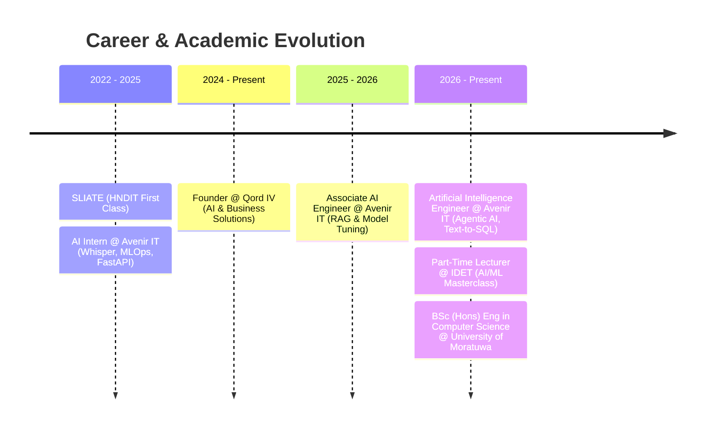

<div align="center">

  <!-- Hero Visual Banner -->
  <a href="https://adithyabandara.com">
    
  </a>

  <br/><br/>

  <!-- Dynamic Header Wave -->
  

  <h3 align="center">
    🚀 Founder @ <a href="https://qordiv.com">Qord IV</a> &nbsp;|&nbsp; 
    🧠 AI Engineer @ <a href="https://avenir-it.com">Avenir IT</a> &nbsp;|&nbsp; 
    🎓 CS Undergrad @ <a href="https://uom.lk">UoM</a> &nbsp;|&nbsp; 
    💡 Lecturer @ IDET
  </h3>

  <!-- Typing Animation with Emerald/Cyan Theme -->
  <p align="center">
    <a href="https://adithyabandara.com">
      
    </a>
  </p>

  <!-- Connect & Social Badges -->
  <p align="center">
    <a href="https://adithyabandara.com">
      
    </a>
    <a href="https://www.linkedin.com/in/adithya-bandara/">
      
    </a>
    <a href="mailto:dammikaekanayaka1980@gmail.com">
      
    </a>
    <a href="https://wa.me/94712494420?text=Hello!%20I%27m%20interested%20in%20your%20work.%20Can%20we%20chat%3F">
      
    </a>
    <a href="https://github.com/AdhiDevX369">
      
    </a>
  </p>

</div>

---

<br/>

## 👨‍💻 Executive Summary

<table>
  <tr>
    <td width="30%" align="center" valign="middle">
      <a href="https://adithyabandara.com">
        
      </a>
      <br/><br/>
      <b>Adithya Bandara</b><br/>
      <sub>AI Engineer & Cloud Architect</sub>
    </td>
    <td width="70%" valign="top">
      I am an <b>AI Engineer and Software Architect</b> dedicated to bridging the frontier of machine learning with resilient, scalable cloud architectures. From leading agentic AI systems and Text-to-SQL RAG pipelines to architecting cloud-native solutions, I engineer intelligent software that solves complex real-world problems.
      <br/><br/>
      <ul>
        <li>🚀 <b>Founder</b> at <b><a href="https://qordiv.com">Qord IV</a></b> — Building cutting-edge solutions at the intersection of AI and business innovation.</li>
        <li>🧠 <b>Artificial Intelligence Engineer</b> at <b><a href="https://avenir-it.com">Avenir IT</a></b> — Driving production RAG pipelines, Agentic AI, and automated MLOps lifecycles.</li>
        <li>💡 <b>Part-Time Lecturer</b> at the <b>Institute of Digital Engineering Technology (IDET)</b> — Mentoring the next generation in AI/ML masterclasses.</li>
        <li>🎓 <b>BSc (Hons) in Engineering (Computer Science)</b> at the <b>University of Moratuwa</b> (2026 — 2028).</li>
        <li>🏆 <b>Higher National Diploma in IT (HNDIT)</b> from <b>SLIATE</b> (First Class Distinction).</li>
      </ul>
    </td>
  </tr>
</table>

<br/>

## ⚡ Core Specializations

```
  ┌───────────────────────┐   ┌───────────────────────┐   ┌───────────────────────┐
  │   🤖 AI & Agents      │   │  ☁️ Cloud Solutions   │   │  ⚙️ MLOps & LLMOps    │
  ├───────────────────────┤   ├───────────────────────┤   ├───────────────────────┤
  │ • LLMs & Agentic AI   │   │ • AWS, GCP & Azure    │   │ • Automated CI/CD     │
  │ • Text-to-SQL & RAG   │   │ • Docker & Kubernetes │   │ • Model Monitoring    │
  │ • Whisper & PyTorch   │   │ • Scalable Micro-APIs │   │ • Evaluation & Tuning │
  └───────────────────────┘   └───────────────────────┘   └───────────────────────┘
```

<br/>

## 🛠️ Technical Ecosystem

<div align="center">

### 💻 Languages & Systems
[](https://www.python.org/)
[](https://www.rust-lang.org/)
[](https://go.dev/)
[](https://www.typescriptlang.org/)
[](https://developer.mozilla.org/)
[](https://www.r-project.org/)
[](https://www.java.com/)

<br/>

### 🧠 Artificial Intelligence, Machine Learning & MLOps
[](https://pytorch.org/)
[](https://www.tensorflow.org/)
[](https://huggingface.co/)
[](https://scikit-learn.org/)
[](https://pandas.pydata.org/)
[](https://mlflow.org/)
[](https://www.kaggle.com/)

<br/>

### ☁️ Cloud, DevOps & Infrastructure
[](https://aws.amazon.com/)
[](https://cloud.google.com/)
[](https://azure.microsoft.com/)
[](https://www.docker.com/)
[](https://kubernetes.io/)
[](https://www.terraform.io/)
[](https://github.com/features/actions)
[](https://www.kernel.org/)

<br/>

### 🌐 Web, APIs & Databases
[](https://fastapi.tiangolo.com/)
[](https://nextjs.org/)
[](https://react.dev/)
[](https://nodejs.org/)
[](https://www.postgresql.org/)
[](https://supabase.com/)
[](https://graphql.org/)

</div>

<br/>

## 💼 Career Trajectory



<br/>

## 🚀 Featured Engineering Projects

| Project | Stack | Highlights | Link |
| :--- | :---: | :--- | :---: |
| **🤖 Rust-Exp: AI Chatbot** | `Rust` `Ollama` `CRUD` | High-performance AI chatbot leveraging Rust's memory safety and zero-cost abstractions to interface with local LLMs. | [Explore Repo →](https://github.com/AdhiDevX369/rust-exp) |
| **🔍 MCP-S2xD: AI vs Human Detector** | `Go` `Concurrency` `NLP` | High-throughput content verification engine differentiating human and AI text with concurrent processing pipelines. | [Explore Repo →](https://github.com/AdhiDevX369/MCP-S2xD) |
| **📊 WetherR-Analysis** | `R` `Data Science` `Climate` | Comprehensive meteorological analysis suite for processing, transforming, and visualizing large-scale climate datasets. | [Explore Repo →](https://github.com/AdhiDevX369/WetherR-Analysis) |
| **📰 AclNews-go: NewsBot** | `Go` `Web Scraping` `Bot` | Autonomous news aggregation and distribution engine for real-time social streams with automated filtering. | [Explore Repo →](https://github.com/AdhiDevX369/AclNews-go) |

<br/>

## 💻 Engineering Philosophy

```python
class AIEngineer:
    def __init__(self):
        self.name = "Adithya Bandara"
        self.website = "https://adithyabandara.com"
        self.roles = [
            "Founder @ Qord IV",
            "Artificial Intelligence Engineer @ Avenir IT",
            "Lecturer @ IDET"
        ]
        self.stack = ["Python", "Rust", "Go", "PyTorch", "GCP", "AWS", "Next.js"]

    def philosophy(self) -> str:
        return (
            "At the convergence of artificial intelligence and distributed cloud systems, "
            "I design bridges where neural networks seamlessly integrate into robust architectures, "
            "transforming state-of-the-art algorithms into scalable, production-grade reality."
        )

if __name__ == "__main__":
    engineer = AIEngineer()
    print(f">> {engineer.name} | {engineer.philosophy()}")
```

<br/>

## 📊 Analytics & Activity

<div align="center">
  <a href="https://github.com/AdhiDevX369">
    
  </a>
  <br/><br/>
  
</div>

<br/>

## 📬 Let's Connect & Collaborate

<div align="center">
  <p>Whether you're looking to develop state-of-the-art AI systems, architect scalable cloud backends, or collaborate on innovative tech:</p>

  <a href="https://adithyabandara.com">
    
  </a>
  &nbsp;
  <a href="https://www.linkedin.com/in/adithya-bandara/">
    
  </a>
  &nbsp;
  <a href="mailto:dammikaekanayaka1980@gmail.com">
    
  </a>
  &nbsp;
  <a href="https://wa.me/94712494420?text=Hello!%20I%27m%20interested%20in%20your%20work.%20Can%20we%20chat%3F">
    
  </a>
</div>

<br/>

<div align="center">
  
</div>
